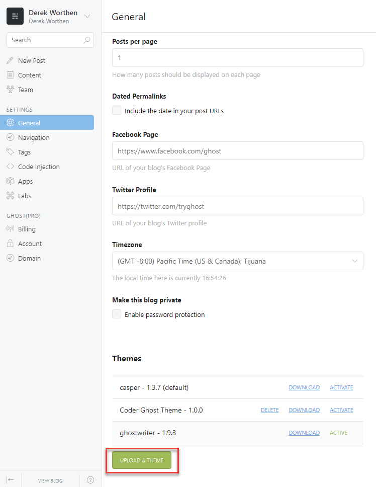
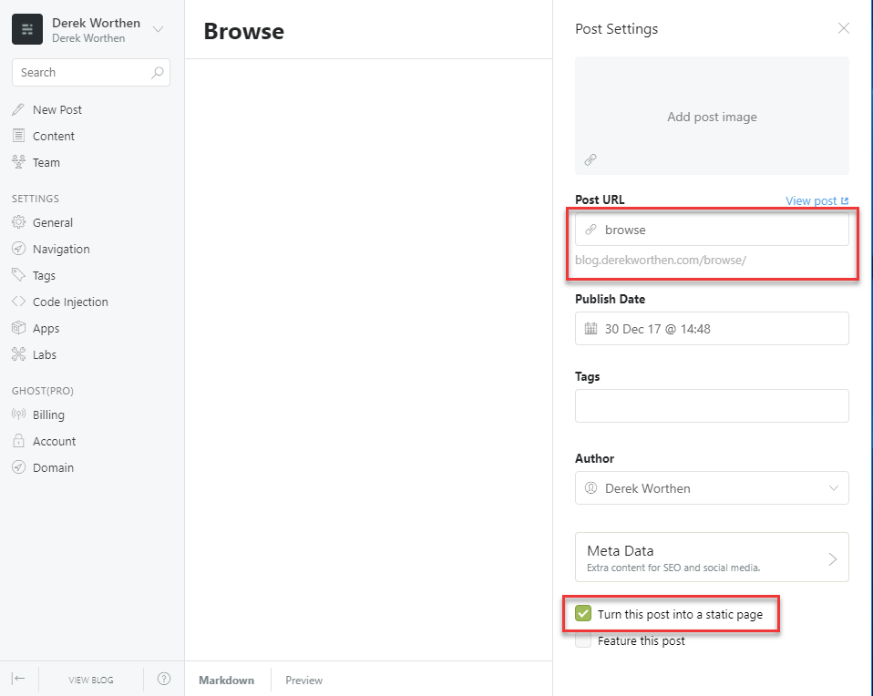
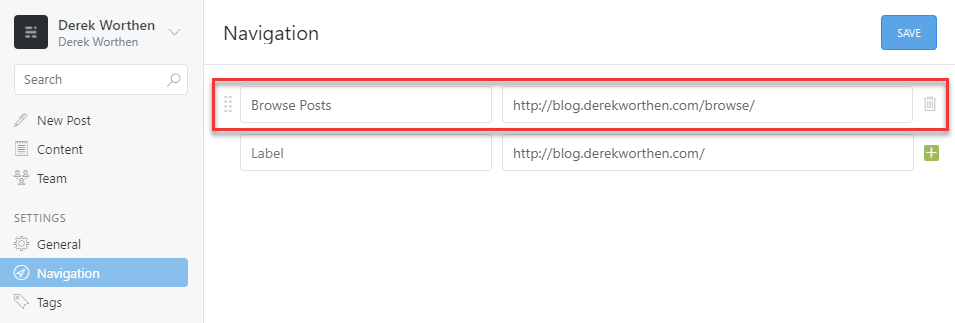
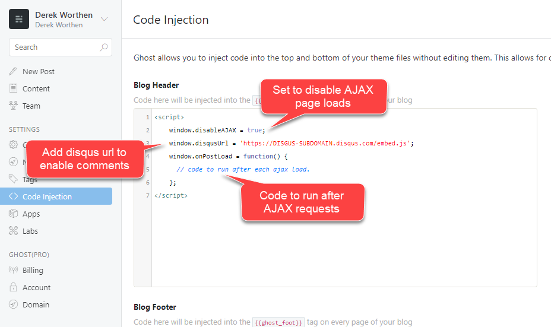

# Ghostwriter

Forked from [roryg/ghostwriter](https://github.com/roryg/ghostwriter). Supports ghost 0.11.x. 

View [derekworthen.com](http://derekworthen.com) for a running demo.

## Differences

- [AJAX loading can be disabled](https://github.com/roryg/ghostwriter/issues/85).  
- [Browse post page has dedicated url](https://github.com/roryg/ghostwriter/issues/84).  
- [Supports embedding gists](https://github.com/roryg/ghostwriter/issues/6). Insert gist script tags as normal.
- [Google prettify](https://github.com/google/code-prettify) is used to render code. 
- Supports [Disqus](https://disqus.com/).

## Install

1. [Download zip](https://github.com/dworthen/ghostwriter/archive/master.zip)
2. Upload zip to ghost:

3. Create static page with browse as the as the Post URL.

4. Add navigation link to the browse static page.

## Options

